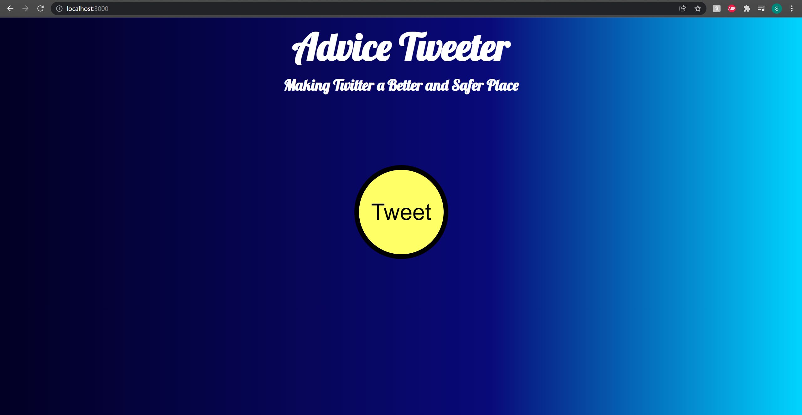
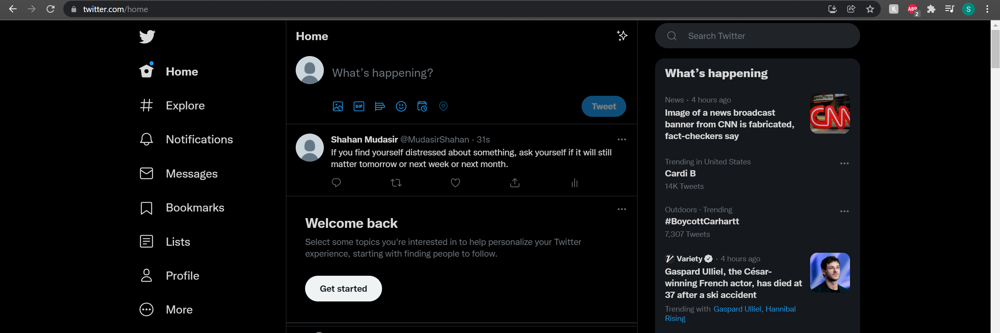

# Advice_Tweeter
### CS 355 Project

##### Click a Button and Automatically Tweet Random Piece of Advice
##### Uses the Twitter API (3-Legged OAuth) and Advice Slip Api
##### Only using Built-In Node.js Modules (fs, http, https, crypto, querystring)

### Home Page

### Output Example

